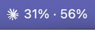
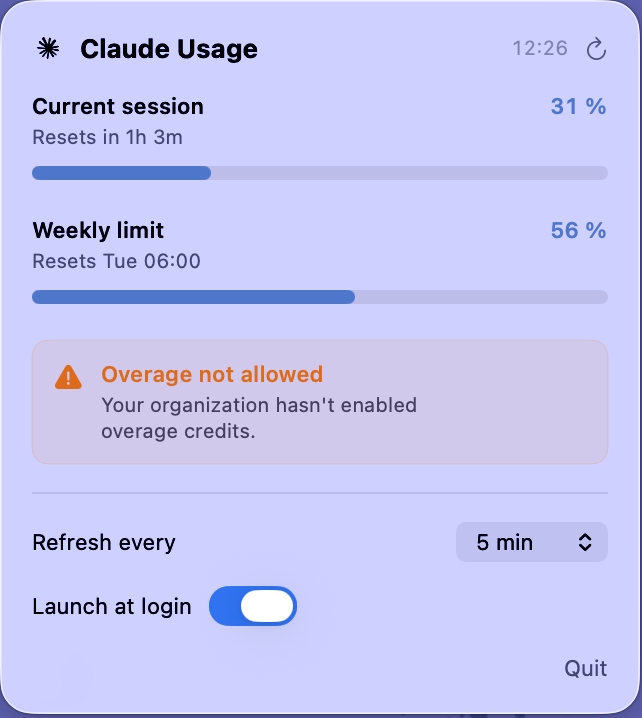

# Claude Usage Bar

[](https://github.com/sdelanos/claude-usage-bar/actions/workflows/ci.yml)
[](https://github.com/sdelanos/claude-usage-bar/releases)
[](https://swift.org)
[](#)
[](LICENSE)

Live Claude API rate-limit usage in your macOS menu bar.

<p align="center">
  
  &nbsp;&nbsp;
  
</p>

The first number is your **5-hour session** utilization, the second your
**7-day window**. Click for reset times, refresh frequency, launch-at-login.

## Install

```sh
brew tap sdelanos/claude-usage-bar
brew install --cask claude-usage-bar
open -a "ClaudeUsageBar"
```

Requires macOS 13+ and a [Claude Code](https://docs.claude.com/en/docs/claude-code/overview)
subscription (Pro, Max, Team, Enterprise).

First launch: click the menu-bar icon, follow the **Set up authentication**
card — one paste of `claude setup-token` and you're done.

## Why a separate token?

Earlier versions read Claude Code's own keychain entry. macOS prompted
for keychain access once, you clicked "Always Allow", and that was
supposed to be it. Except Claude Code rewrites its credentials entry
every time the OAuth token rotates (~hourly), which resets the ACL —
prompting again. Forever.

This app authenticates with `claude setup-token`, the documented
Anthropic flow for unattended subscribers. The resulting 1-year bearer
lives in a keychain item the app owns, never gets rewritten, never
re-prompts. Threat model in [SECURITY.md](SECURITY.md).

## Build from source

```sh
curl -fsSL https://raw.githubusercontent.com/sdelanos/claude-usage-bar/main/install.sh | bash
```

Or `git clone` + `./setup-cert.sh` + `./build.sh`. The install script
checks every prerequisite (CLT, Swift 6) and reports them in one batch.

## Tests

```sh
swift test
```

60 tests across the parser, the state machine, the token store, the
threshold-crossing rules, error translation, and the secret-token
redaction guarantees. CI runs on macOS 15 and 26 with coverage + a
release-config build + a swiftformat lint job.

## Contributing & Security

- [CONTRIBUTING.md](CONTRIBUTING.md) — architecture, style, testing
- [SECURITY.md](SECURITY.md) — threat model, vuln disclosure
- [RELEASING.md](RELEASING.md) — release loop
- [CHANGELOG.md](CHANGELOG.md)

## License

MIT. The bundled menu-bar icon is the Claude tray-icon template,
sourced from Anthropic's Claude desktop app; all rights belong to
Anthropic.
